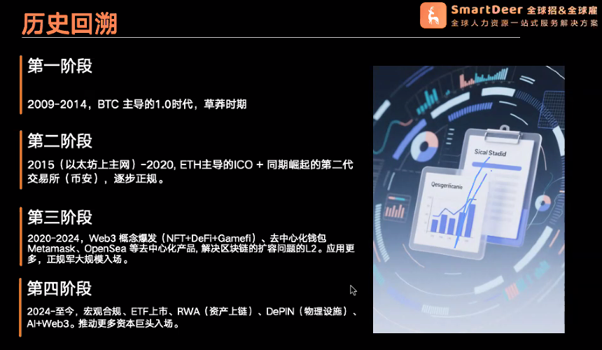
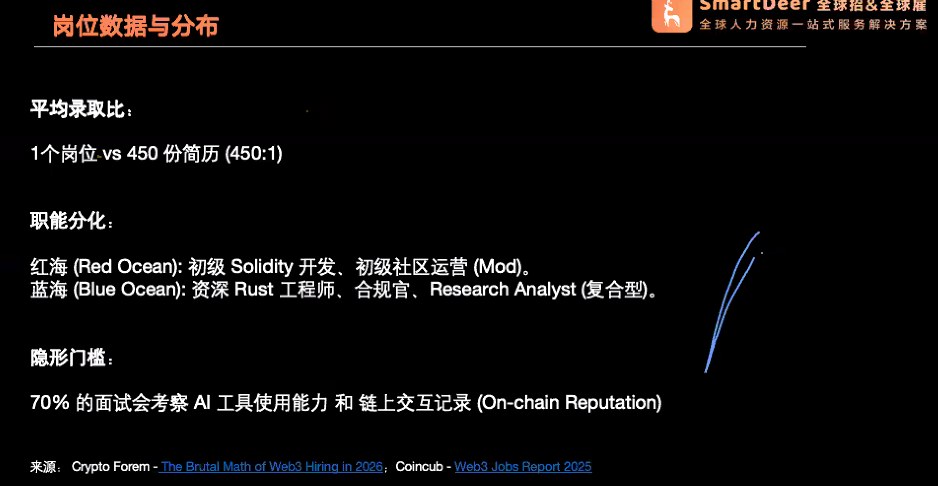
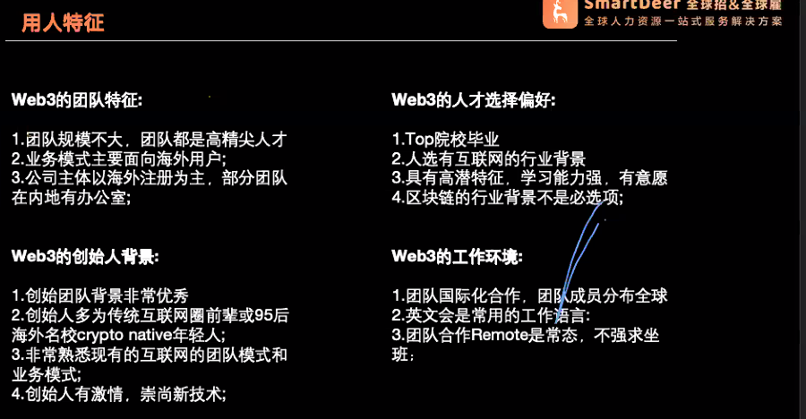
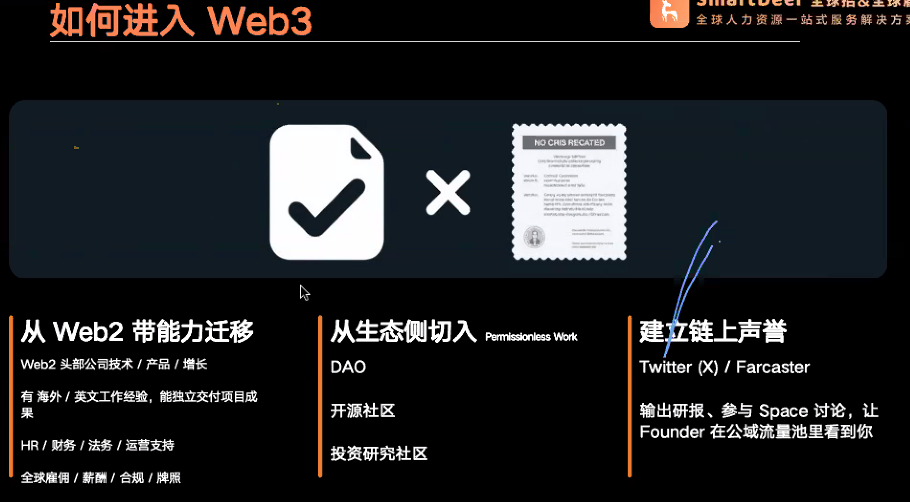
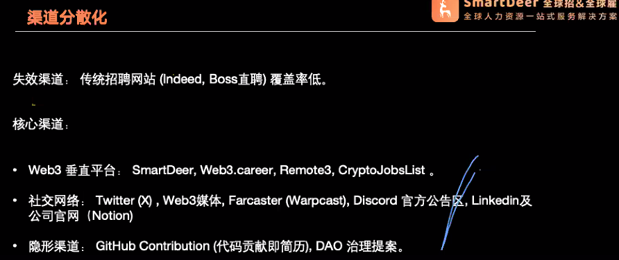
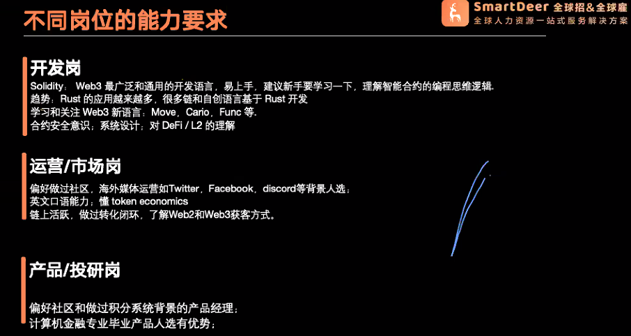

# Web3 行业全局介绍 & 岗位概览-会议记录

日期: 2026年1月12日

### 一、 行业背景与发展历程

**1. Web3 发展三阶段：**

- **第一阶段（2009-2014）：** 极客与黄金时代。以比特币为主，密码学与理想主义者的实验，无智能合约 。
- **第二阶段（2015-2019）：** 造富与乱象并存。以太坊上线引入智能合约，ICO爆发，DeFi（去中心化金融）和币安等交易所崛起 。
- **第三阶段（2020-至今）：** 行业爆发期。NFT、GameFi、Layer2 等应用层打开，正规军开始入场 。
    
    
    

**2. 近两年（2024-2026）的核心变化：**

- **政治与监管环境转暖：** 特朗普当选后对加密行业从怀疑转向支持，监管松绑，甚至讨论将比特币纳入国家战略储备 。
- **金融通道打通：** 美国通过比特币和以太坊现货 ETF，加密资产从“另类投资”变为类似黄金、石油的主流大宗资产 。
- **机构入场与新赛道：** 贝莱德等巨头布局，RWA（现实世界资产上链）和 DePIN（去中心化物理基础设施网络）成为重点，推动应用与实体经济结合 。
    
    
    

### 二、 就业市场现状与数据

**1. 市场规模与人才杠杆：**

- **高人效：** Web3 是人造杠杆率最高的行业之一，10人的团队可能管理着10亿美金的 TVL（总锁仓价值），因此核心人才薪资极高 。
- **开发者缺口：** 支撑万亿市值的活跃开发者数量仅为 2.5-3 万人左右 。
    
    
    

**2. 招聘现状（2025年数据）：**

- **职位反弹：** 全球主要 Web3 招聘平台新增约 6.6 万个初创职位，反弹了 47% 。
- **结构性缺口：** 初级人才过剩（450份简历抢一个初级岗位），但资深 Rust 工程师、合规专家等精英人才极度短缺，企业愿支付 50% 溢价抢人 。
    
    
    
- **地域分布：**
    - **硬核技术：** 北美（硅谷、纽约）仍是中心。
    - **交易所/资管/运营：** 亚洲（香港、新加坡）和中东（迪拜）是重心
        
        
        

### 三、 岗位画像与薪酬体系

岗位分布上，技术岗占比最高（32%），其次是项目管理/产品（27%），之后是运营、市场、合规等 。

**薪资梯队（由高到低）：**

1. **第一梯队：技术与合规**
    - **岗位：** 智能合约开发、安全审计、合规法务。
    - **特点：** 代码是底层，合规决定生存。Senior 级别年薪破几十万美金常态化 。
2. **第二梯队：研究与核心产品**
    - **岗位：** Research（研究员）、核心产品经理。
    - **特点：** 懂 Tokenomics（代币经济学）的研究员价值极高，天花板很高，可转型投资人 。
3. **第三梯队：运营与增长**
    - **岗位：** 社区运营、市场增长。
    - **特点：** 薪资方差大。普通运营类似客服；但若能做到“增长黑客”，带来真实用户和 TVL，奖金和 Token 分成可能超过开发人员 。

### 四、 求职实战指南：如何拿下 Offer

**1. 核心逻辑：**

- **“你是谁不如你做过什么”：** 海投简历效果差，更看重**链上履历**（Github 绿格子、Snapshot 投票记录、Mirror 文章、DAO 提案） 。
    
    
    
- **去中心化渠道：** 关注 Web3 垂直招聘平台（如 Smart Deer）、Twitter（X）、Discord 官方公告、以及链上痕迹 。
    
    
    

**2. 技能要求“敲门砖”：**

- **开发岗：**
    - 必须掌握 Solidity（通用基础）；
    - 进阶推荐 Rust、Move、Cairo（Layer 2 及新生态需求大）；
    - 必须具备合约安全意识 。
- **运营/市场岗：**
    - 英语口语是硬指标（面向 Global 市场）；
    - 懂 Tokenomics，有链上交互经验，具备 Web2+Web3 的增长黑客能力 。
- **产品/投研岗：**
    - 需具备 Web3 Sense（网感），懂金融知识和积分系统设计 。
    
    
    

**3. 面试建议：**

- **善用 AI 但不依赖 AI：** 70% 的面试会考察是否会使用 AI 工具提效，但要有自己的框架 。
- **尽职调查（防坑）：** 警惕匿名团队、无代码更新、无风投支持的“三无”项目，检查 Github 提交频率和创始人过往背景，防止被 Rug（卷款跑路） 。

[Web3求职现状 - Emily.pdf](Web3%E6%B1%82%E8%81%8C%E7%8E%B0%E7%8A%B6_-_Emily.pdf)

# Q&A（分类版）

### 一、 合规与法律 (Legal & Compliance)

**Q: 传统律师（在职）如何转型 Web3 合规/法务？需要什么知识储备？**

- **核心关注点：** 虽然国内（中国大陆）有限制，但合规岗位主要面向香港、迪拜、美国、新加坡、欧洲等地。重点需要了解**反洗钱 (AML)** 和**反恐怖融资 (CFT)** 。
- **具体法案：** 需熟悉各地区的牌照制度，例如欧洲的 **MiCA 法案**，香港和新加坡的 **VASP (虚拟资产服务提供商)** 制度 。
- **转型建议：** 不一定非要出国读书。建议先从实践角度切入，利用现有法律背景，尝试为项目提供建议，或者考取相关证书（如公认反洗钱师 CAMS）。

### 二、 职业规划与入行路径 (Career Path)

**Q: 应届生该先去互联网大厂（Web2）还是直接进 Web3？**

- **时机选择：** 如果是 2026 年及以后毕业，且能进入大厂积累 3-5 年经验（落地项目、带过团队），Web3 项目方会非常欢迎，因为看重成熟的方法论和资源 。
- **直接入行：** 如果现在就对行业非常了解且有热情，直接进入 Web3 也没问题。两条路径各有利弊：大厂积累资源和背书，直接入行积累行业深度 。

**Q: 房地产行业中高管（30-40岁+）如何转型？**

- **痛点：** 传统行业经验（如客户研究、市场定位）难以直接平移，且缺乏代码/金融背景，中高层岗位要求垂直行业经验 。
- **建议方向：** **运营 (Operations)** 或 **BD** 可能比产品岗更合适，因为需要调动资源和管理团队
- **行动方案：** 初期可能需要做一些 "Permissionless Work"（无许可工作），例如免费为项目提供参谋、协助团队搭建，在推特上活跃以建立“链上足迹”和声誉，从而吸引项目方注意 。

**Q: 留学生（NYU硕士）如何进入公链或大机构做 BD？**

- **策略：** 锁定大项目（如公链、交易所）的实习机会。如果暂时没有，多在目标公司的社群（Discord/Twitter）活跃，刷脸熟 。
- **心态：** 顶级交易所（如 Binance）筛选非常严格，一次投不中很正常，需要针对性地反复投递，展示与岗位的匹配度 。

### 三、 热门岗位解析 (Specific Roles)

**Q: “增长 (Growth)” 和 “BD” 有什么区别？**

- **增长 (Growth)：** 更像是一个概念或目标。
    - **产品侧：** 通过机制设计（如拼多多的砍一刀、StepN 的游戏化积分）带来用户裂变 。
    - **运营侧：** 需要懂流量玩法和黑客增长 。
- **BD (商务拓展)：** 侧重于点对点的开发，如谈项目合作、机构客户、大客户资源置换 。
- **核心能力：** 做增长不仅要会写推文，还要懂 Tokenomics（代币经济学），最好有自己的资源池用于置换 。

**Q: 投研 (Investment Research) 新人的技能树与发展路线？**

- **必备技能：** 快速分析项目（代币经济学、机制、周期）、数据分析工具（Dune, Nansen 等）、基础代码阅读能力（加分项） 。
- **入门动作：** 自己或组队产出深度研报（选定 Layer2、RWA 等细分赛道），作为求职的“敲门砖” 。
- **职业路径：** 投研 -> 基金经理/一级二级市场投资 -> 独立投资人 。

**Q: 安全治理 (Security Governance) 岗位只有大公司有吗？**

- **现状：** 是的，通常涉及大资金、大阶段的项目才会有专门的合规审计岗 。
- **机会：** 无论大小公司都欢迎实习生，建议多关注垂直招聘平台 。

### 四、 求职技巧与避坑 (Tips & Risk Management)

**Q: 远程工作如何判断项目方是否靠谱（防 Rug/跑路）？**

- **看资方：** 有知名 VC (风险投资) 背书的项目风险较小 。
- **看团队：** 拒绝“三无”团队（无融资、无代码更新、全员匿名）。去 LinkedIn 查核心成员过往履历，看是否有不良历史 。
- **看代码：** 检查 Github 的代码提交频率 。
- **建议：** 新人尽量先去大项目，保障相对较好 。

**Q: 如何展示自己的作品（链上简历）？**

- **方法：** 不需要去别人的 Discord 硬发。在 Twitter/X 或 Mirror 上持续输出有价值的内容（研报、观点），社交媒体的数据（点赞、转发）本身就是一种价值证明和展示 。

**Q: 劳动合同与薪资保障？**

- **大厂：** 通常会签约，有合规的发薪渠道（法币）。
- **小团队/DAO：** 很多不签正式劳动合同，直接发 Crypto（加密货币/稳定币）。这类情况需要自己多留心眼，风险自担 。